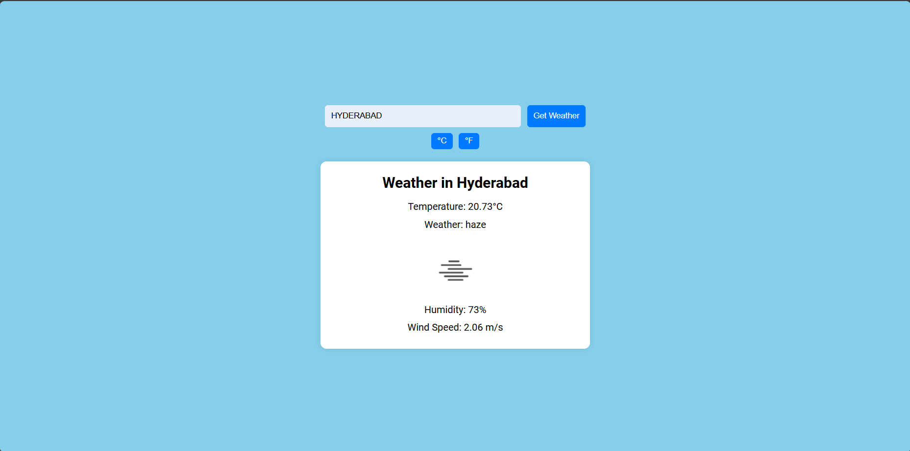

# Weather Forecast Dashboard

This is a simple weather forecast dashboard that allows users to get the current weather information for a specified city. Users can toggle between Celsius and Fahrenheit units for temperature display.

## Features

- Search for weather information by city name.
- Display current temperature, weather description, humidity, and wind speed.
- Toggle between Celsius (°C) and Fahrenheit (°F) units.

## Technologies Used

- HTML
- CSS
- JavaScript
- OpenWeatherMap API

## How to Use

1. Enter the name of the city in the input field.
2. Click the "Get Weather" button to fetch and display the weather information.
3. Use the toggle buttons to switch between Celsius and Fahrenheit units.

## Setup

1. Clone the repository to your local machine.
2. Open the `index.html` file in your web browser.

## Screenshot

## Author

Shaik Abdul Munawar

[LinkedIn Profile](https://www.linkedin.com/in/shaik-abdul-munawar-b35821284)
